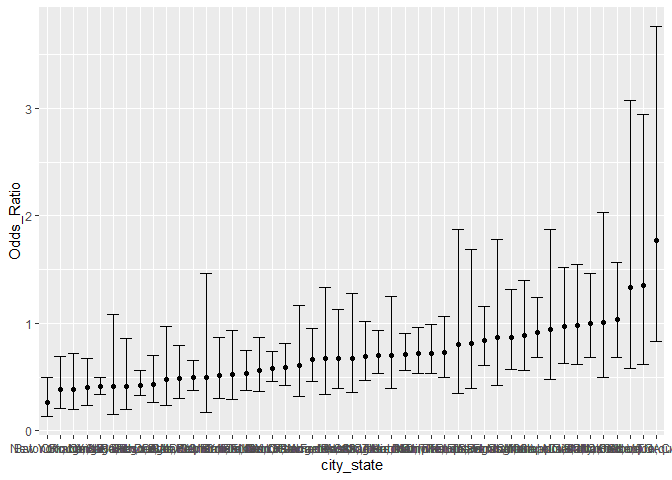
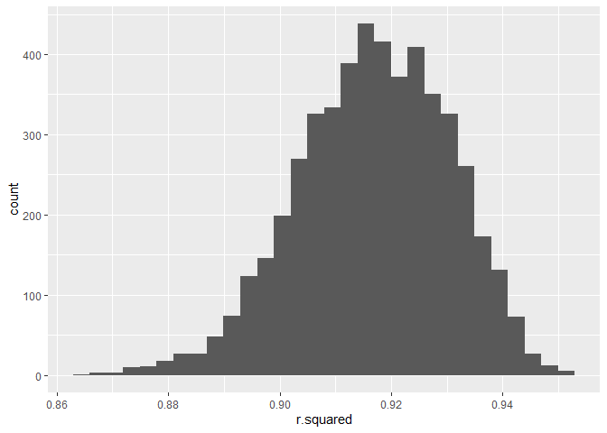
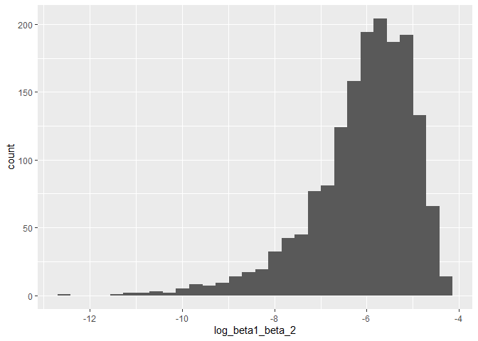
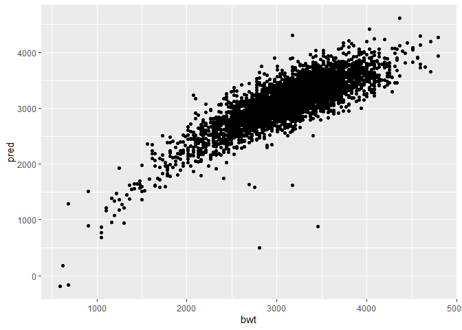
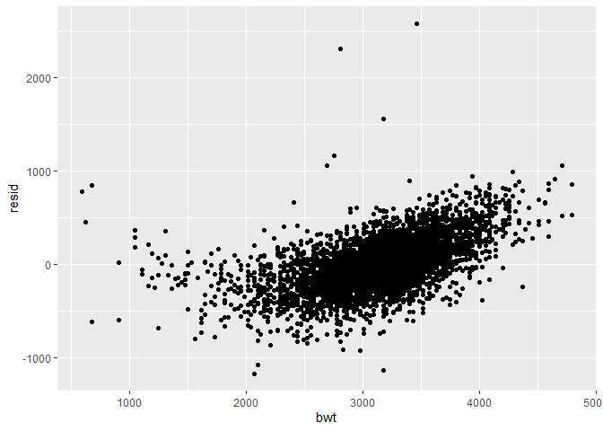
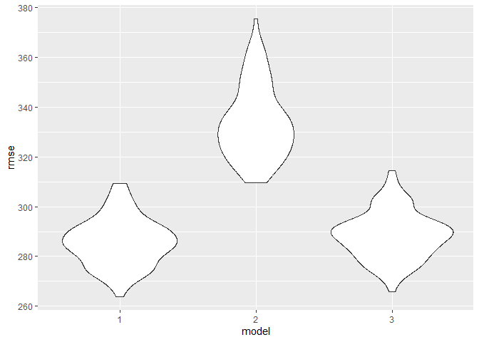

p8105_hw6_zh2596
================
Zilin Huang
2023-11-30

## Problem 1

Import and clean the homicide data

``` r
homicide <- read.csv("data/homicide-data.csv")

homicide = 
  homicide |> 
  mutate(
    city_state = str_c(city, state, sep = ", "),
    resolution = case_when(
      disposition == "Closed without arrest" ~ 0,
      disposition == "Open/No arrest"        ~ 0,
      disposition == "Closed by arrest"      ~ 1),
    victim_age = as.numeric(victim_age)
  ) |> 
  filter(victim_race %in% c("White", "Black")) |> 
  filter(!(city_state %in% c("Tulsa, AL", "Dallas, TX", "Phoenix, AZ", "Kansas City, MO"))) |> 
  select(city_state, resolution, victim_age, victim_sex, victim_race)
```

    ## Warning: There was 1 warning in `mutate()`.
    ## ℹ In argument: `victim_age = as.numeric(victim_age)`.
    ## Caused by warning:
    ## ! NAs introduced by coercion

Fit a `glm` model for the city of Baltimore, MD

``` r
homicide_glm = 
  filter(homicide, city_state == "Baltimore, MD") |> 
  glm(resolution ~ victim_age + victim_sex + victim_race, family = binomial(), data = _) |>
  broom::tidy() |>
  mutate(
    Odds_Ratio = exp(estimate), 
    Odds_Ratio_upper = exp(estimate + 1.96 * std.error),
    Odds_Ratio_lower = exp(estimate - 1.96 * std.error)) |> 
  filter(term == "victim_sexMale") |> 
  select(Odds_Ratio, Odds_Ratio_lower, Odds_Ratio_upper)
```

Fit `glm` models for all cities

``` r
model_cities = 
  homicide |> 
  nest(data = -city_state) |> 
  mutate(
    models = map(data, \(df) glm(resolution ~ victim_age + victim_sex + victim_race, 
                             family = binomial(), data = df)),
    tidy_models = map(models, broom::tidy)) |> 
  select(-models, -data) |> 
  unnest(cols = tidy_models) |> 
  mutate(
    Odds_Ratio = exp(estimate), 
    Odds_Ratio_upper = exp(estimate + 1.96 * std.error),
    Odds_Ratio_lower = exp(estimate - 1.96 * std.error)) |> 
  filter(term == "victim_sexMale") |> 
  select(city_state, Odds_Ratio, Odds_Ratio_lower, Odds_Ratio_upper)
```

Create a plot that shows the estimated ORs and CIs for each city.
Organize cities according to estimated OR, and comment on the plot

``` r
model_cities |> 
  mutate(city_state = fct_reorder(city_state, Odds_Ratio)) |> 
  ggplot(aes(x = city_state, y = Odds_Ratio)) + 
  geom_point() + 
  geom_errorbar(aes(ymin = Odds_Ratio_lower, ymax = Odds_Ratio_upper))
```

<!-- -->

## Problem 2

Import the data

``` r
weather_df = 
  rnoaa::meteo_pull_monitors(
    c("USW00094728"),
    var = c("PRCP", "TMIN", "TMAX"), 
    date_min = "2022-01-01",
    date_max = "2022-12-31") |>
  mutate(
    name = recode(id, USW00094728 = "CentralPark_NY"),
    tmin = tmin / 10,
    tmax = tmax / 10) |>
  select(name, id, everything())
```

    ## using cached file: C:\Users\huang\AppData\Local/R/cache/R/rnoaa/noaa_ghcnd/USW00094728.dly

    ## date created (size, mb): 2023-09-28 10:20:36.026108 (8.541)

    ## file min/max dates: 1869-01-01 / 2023-09-30

``` r
set.seed(1)
         
weather_df_strap =
  weather_df |>
  modelr::bootstrap(n = 5000) |>
  mutate(
    models = map(strap, \(df) lm(tmax ~ tmin + prcp, data = df)),
    results_for_r_square = map(models, broom::glance),
    results_for_beta = map(models, broom::tidy)
  )
```

Generate estimates of the 5000 $r^2$ values, find its $2.5\%$ and
$97.5\%$ quantiles, and plot its distribution

``` r
weather_df_r_squared =
  weather_df_strap |>
  select(results_for_r_square) |> 
  unnest(results_for_r_square) |>
  select(r.squared) 

weather_df_r_squared |>      
  summarize(
    ci_lower = quantile(r.squared, 0.025), 
    ci_upper = quantile(r.squared, 0.975))
```

    ## # A tibble: 1 × 2
    ##   ci_lower ci_upper
    ##      <dbl>    <dbl>
    ## 1    0.889    0.941

``` r
weather_df_r_squared |>
  ggplot(aes(x=r.squared)) + geom_histogram()
```

    ## `stat_bin()` using `bins = 30`. Pick better value with `binwidth`.

<!-- -->

The distribution of $r^2$ is approximately symmetric around the value of
0.91.

Generate estimates of the 5000 $log(\beta_1 * \beta_2)$ values, find its
$2.5\%$ and $97.5\%$ quantiles, and plot its distribution

``` r
weather_df_beta =
  weather_df_strap |>
  select(results_for_beta) |>
  unnest(results_for_beta) |>
  select(-c(std.error, statistic, p.value)) |>
  filter(term != "(Intercept)") |>
  mutate(boot_id = rep(1:5000, each=2))  |>
  pivot_wider(
    names_from = "term",
    values_from = "estimate"
  ) |>
  mutate(
    log_beta1_beta_2 = log(tmin * prcp)
  ) |>
  select(log_beta1_beta_2)
```

    ## Warning: There was 1 warning in `mutate()`.
    ## ℹ In argument: `log_beta1_beta_2 = log(tmin * prcp)`.
    ## Caused by warning in `log()`:
    ## ! NaNs produced

``` r
weather_df_beta |>      
  summarize(
    ci_lower = quantile(log_beta1_beta_2, 0.025, na.rm = TRUE), 
    ci_upper = quantile(log_beta1_beta_2, 0.975, na.rm = TRUE))
```

    ## # A tibble: 1 × 2
    ##   ci_lower ci_upper
    ##      <dbl>    <dbl>
    ## 1    -8.98    -4.60

``` r
weather_df_beta |>
  ggplot(aes(x=log_beta1_beta_2)) + geom_histogram()
```

    ## `stat_bin()` using `bins = 30`. Pick better value with `binwidth`.

    ## Warning: Removed 3361 rows containing non-finite values (`stat_bin()`).

<!-- -->

The distribution of $log(\beta_1 * \beta_2)$ is approximately
left-skewed.

## Problem 3

Import and clean the dataset

``` r
birthweight = read.csv("data/birthweight.csv") |>
  drop_na() 

birthweight$babysex = as.factor(birthweight$babysex)
birthweight$malform = as.factor(birthweight$malform)
birthweight$frace = as.factor(birthweight$frace)
birthweight$mrace = as.factor(birthweight$mrace)
```

Based on the hypothesized structure for the factors that underly
birthweight, I propose that babies and mothers’ body status (like
height, age at delivery, etc.) as well as their smoking status may
function as the coefficients affecting babies’ birthweight. Thus, I make
the following regression model.

``` r
fit_1 = lm(bwt ~ bhead + blength + smoken + mheight + momage + ppbmi + ppwt , data = birthweight)
summary(fit_1)
```

    ## 
    ## Call:
    ## lm(formula = bwt ~ bhead + blength + smoken + mheight + momage + 
    ##     ppbmi + ppwt, data = birthweight)
    ## 
    ## Residuals:
    ##      Min       1Q   Median       3Q      Max 
    ## -1169.88  -183.99    -6.32   177.56  2571.93 
    ## 
    ## Coefficients:
    ##               Estimate Std. Error t value Pr(>|t|)    
    ## (Intercept) -6822.9074   686.1327  -9.944  < 2e-16 ***
    ## bhead         143.3826     3.4637  41.396  < 2e-16 ***
    ## blength        82.5664     2.0688  39.911  < 2e-16 ***
    ## smoken         -2.0763     0.5902  -3.518  0.00044 ***
    ## mheight        12.6855    10.7557   1.179  0.23830    
    ## momage          5.8472     1.1377   5.140 2.87e-07 ***
    ## ppbmi           3.4194    15.5638   0.220  0.82611    
    ## ppwt            0.1243     2.7014   0.046  0.96330    
    ## ---
    ## Signif. codes:  0 '***' 0.001 '**' 0.01 '*' 0.05 '.' 0.1 ' ' 1
    ## 
    ## Residual standard error: 285.8 on 4334 degrees of freedom
    ## Multiple R-squared:  0.6892, Adjusted R-squared:  0.6887 
    ## F-statistic:  1373 on 7 and 4334 DF,  p-value: < 2.2e-16

I then show a plot of model residuals against fitted values using
`add_predictions` and `add_residuals`

``` r
birthweight |>
  add_predictions(fit_1) |>
  ggplot(aes(x = bwt, y = pred)) + geom_point()
```

<!-- -->

``` r
birthweight |>
  add_residuals(fit_1) |>
  ggplot(aes(x = bwt, y = resid)) + geom_point()
```

<!-- -->
Since the plot of real birthweight value against its predicted
counterpart is linear, and the plot of real value against residuals is
non-linear, I would deduce that this model fits well to predict babies’
birthweight value.

Compare to other two models, the first one using length at birth and
gestational age as predictors (main effects only), the second one using
head circumference, length, sex, and all interactions (including the
three-way interaction) between these

``` r
fit_2 = lm(bwt ~ blength + gaweeks, data = birthweight)
fit_3 = lm(bwt ~ bhead + blength + babysex + bhead*blength + 
           bhead*babysex + blength*babysex + blength*babysex*blength, data = birthweight)
```

Compare the three models using `crossv_mc` for generating
cross-validated prediction errors

``` r
cv_df = 
  crossv_mc(birthweight, 100) |>
  mutate(
    train = map(train, as_tibble),
    test = map(test, as_tibble)) |>
  mutate(
    mod_1 = map(train, \(df) fit_1),
    mod_2 = map(train, \(df) fit_2),
    mod_3 = map(train, \(df) fit_3)
  ) |> 
  mutate(
    rmse_1 = map2_dbl(mod_1, test, \(mod, df) rmse(model = mod, data = df)),
    rmse_2 = map2_dbl(mod_2, test, \(mod, df) rmse(model = mod, data = df)),
    rmse_3 = map2_dbl(mod_3, test, \(mod, df) rmse(model = mod, data = df)))

cv_df |> 
  select(starts_with("rmse")) |> 
  pivot_longer(
    everything(),
    names_to = "model", 
    values_to = "rmse",
    names_prefix = "rmse_") |> 
  mutate(model = fct_inorder(model)) |> 
  ggplot(aes(x = model, y = rmse)) + geom_violin()
```

<!-- -->

It seems like model 2 contains the highest cross-validated prediction
error value, implying that a model only considering one of babies’ body
status index (length at birth) and mothers’ gestational age may not
predict the birth weight well.
